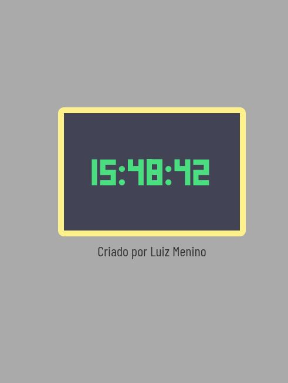

<h1 align="center"> Relógio Digital </h1>

 

## 🚀 Tecnologias

Esse projeto foi desenvolvido com as seguintes tecnologias:

- HTML e CSS
- JavaScript

 

 
<h3 align="center">Print do relógio </h3>

 
  

 

## 💻 Projeto

O projeto é um **Relógio Digital** desenvolvido para práticar as habilidades das tecnologias utilizadas.
