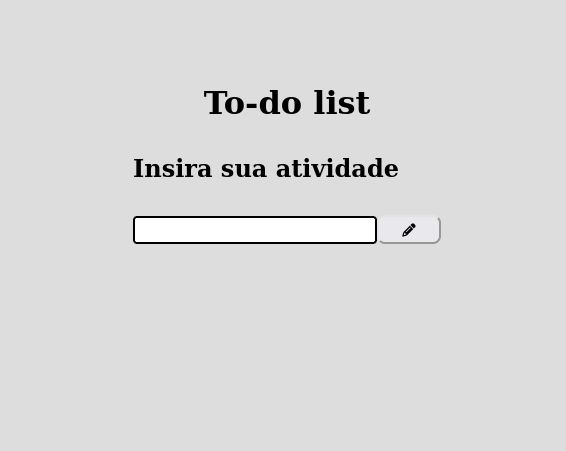
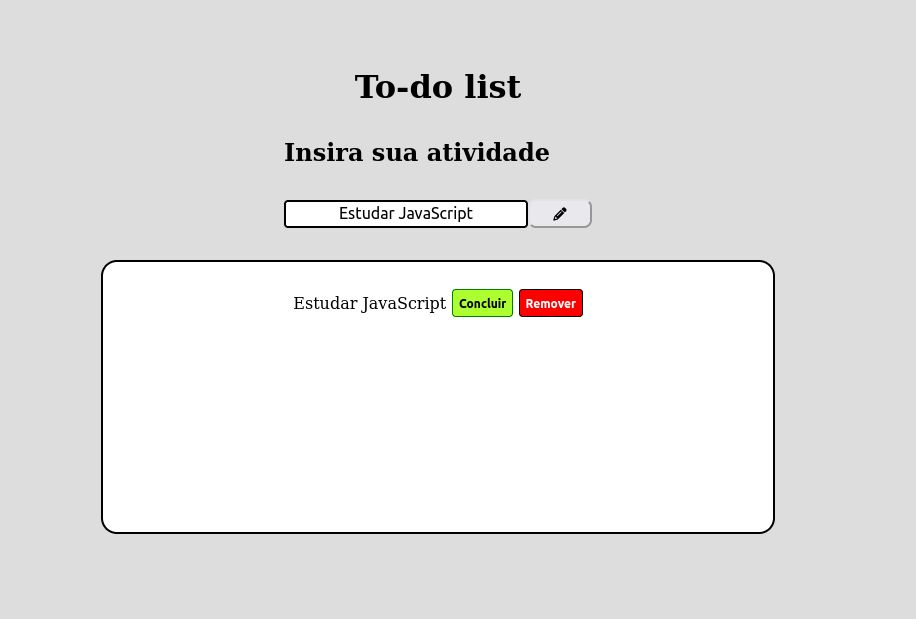
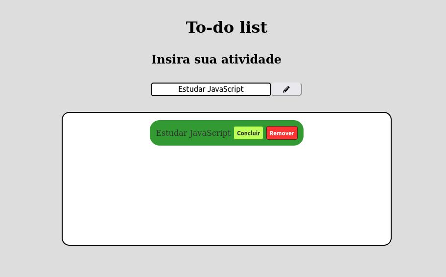
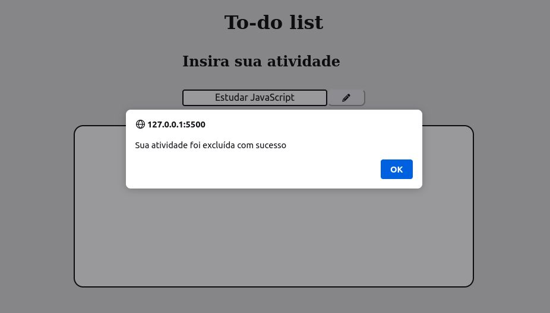
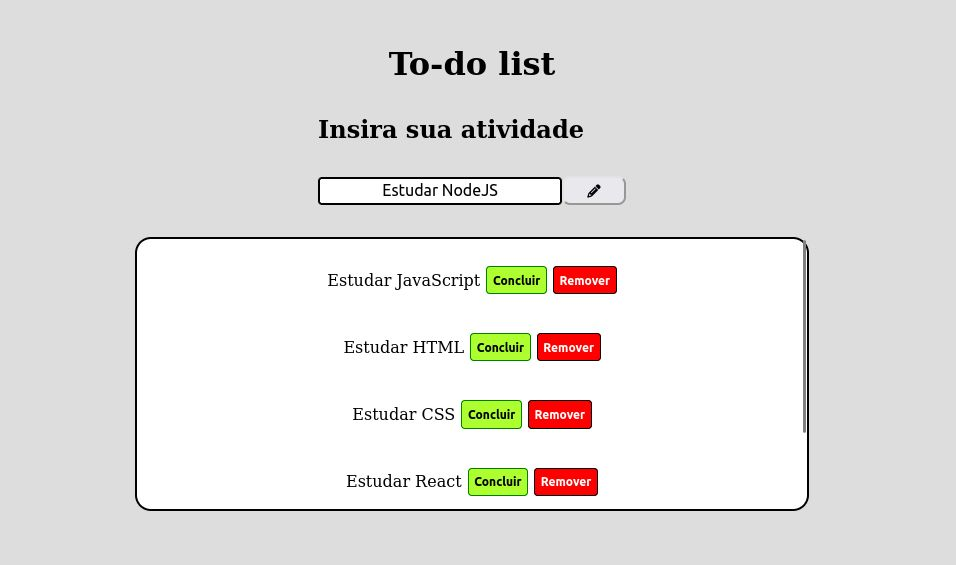

<h1 align="center"> To-do List </h1>

 

## 🚀 Tecnologias

Esse projeto foi desenvolvido com as seguintes tecnologias:

- HTML e CSS
- JavaScript

 

 
<h3 align="center">Print do to-do list </h3>

 
  

 

 
<h3 align="center">Print do to-do list (adicionando tarefa) </h3>

 
  

 

 
<h3 align="center">Print do to-do list (concluindo tarefa) </h3>

 
  

 

 
<h3 align="center">Print do to-do list (removendo a tarefa) </h3>

 
  

 

 
<h3 align="center">Print do to-do list (adicionando várias tarefas) </h3>

 
  

 

## 💻 Projeto

O projeto é um **To-do List** desenvolvido para práticar as habilidades das tecnologias utilizadas.
